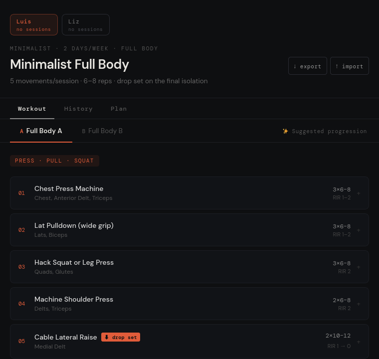
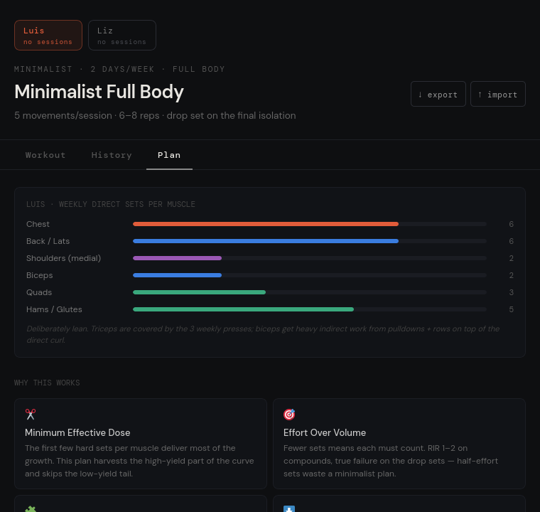

# Minimalist Full Body

A self-contained Progressive Web App for logging a 2-day full-body hypertrophy routine.
Install it on your phone, take it to the gym, and it works **offline** — no account,
no server, no tracking. All data lives in your browser's `localStorage`.

[](https://donxepe.github.io/sbmw/)
[](https://github.com/donxepe/sbmw/actions/workflows/deploy.yml)
[](LICENSE)

| Workout view | Plan view |
|---|---|
|  |  |

## Features

- **2-day full-body split** (Day A / Day B), 5 movements per session, built around
  a minimum-effective-dose approach: compound-heavy, drop set on the final isolation.
- **Per-set logging** in lbs with RIR targets, rest intervals, and warm-up sets.
- **Suggested progression** — each finished session snapshots its loads; the next
  suggestion only advances if you hit everything, otherwise it repeats as a retry.
- **Session history** with a combined timeline across profiles.
- **Multiple profiles** (the app ships with two configured plans).
- **"Why this works" cards** — the programming rationale is documented in-app,
  including per-muscle weekly volume targets.
- **JSON export/import** — one file is your backup; re-importing merges by session ID,
  so it's idempotent and never duplicates history.
- **Offline-first PWA** — a service worker caches the whole app after the first load,
  so it opens at the gym with no signal.

## Tech

Deliberately minimal: **one HTML file**, no build step, no bundler, no dependencies to install.

| File | Role |
|---|---|
| `index.html` | The entire app — data, React component, styles, bootstrap (~900 lines) |
| `sw.js` | Service worker; cache-first offline shell with a content-hashed cache name |
| `manifest.webmanifest` | PWA manifest (installable / add to home screen) |
| `icon-192.png`, `icon-512.png` | App icons |

React 18 and Babel load from a CDN and JSX compiles in the browser at runtime — the
tradeoff for zero tooling. A GitHub Actions pipeline gates every push: it extracts the
JSX, verifies it compiles, and checks that every asset the page loads is registered in
the service worker (so offline can't silently break). On deploy it stamps the cache
name with a hash of the app files, guaranteeing clients always pick up changed code.

## Run it locally

The service worker and install prompt only work over `https://` or `localhost`, so
serve the folder rather than opening the file directly:

```bash
python3 -m http.server 8080
# …or: npx serve -l 8080
```

Then open `http://localhost:8080`. For a true install (offline + home-screen icon),
host it over HTTPS — GitHub Pages, Netlify, Cloudflare Pages, or Vercel all work as-is.

## Customizing the routine

Everything is data-driven. The two day plans live in `daysLuis` / `daysLiz` near the top
of `index.html` — exercise names, sets, reps, RIR, rest, coaching notes, warm-up sets,
and drop-set flags are plain objects, so editing the plan means editing data, not code.

## License

[GPL-3.0](LICENSE). Not medical advice — the routine is a personal program, and the
in-app "why this works" section explains the reasoning behind each choice.
